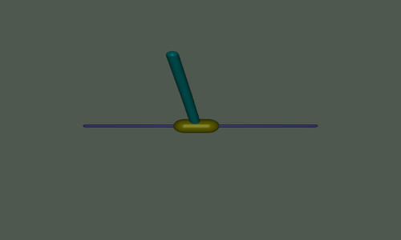

# Overview

This repository contains collection of small-scale projects for testing robotics algorithms in the MuJoCo simulator. Code is implemented and tested in **Ubuntu** system with **Python 3.10**. It aims for testing common algorithms on various types of robots including **robot manipulators** and **legged robots**. This is an **onging** project.

**Examples**
<p align="center">
  
  
</p>


## Run Locally

Clone the project

```bash
  git clone https://github.com/lihanlian/mujoco-playground
```

Go to project directory
```bash
  python3 -m venv env && source env/bin/activate 
```
```bash
  pip install -r requirements.txt
```

Go to specific folder for more detailed information on each individual project.

## References
 - [mjctrl](https://github.com/kevinzakka/mjctrl), [yet-another-mujoco-tutorial](https://github.com/sjchoi86/yet-another-mujoco-tutorial) [Github]
 - [MuJoCo Bootcamp [Website]](https://pab47.github.io/mujoco.html) and corresponding YouTube tutorials ([C++](https://www.youtube.com/watch?v=j1nCeqtfySQ&list=PLc7bpbeTIk758Ad3fkSywdxHWpBh9PM0G&index=7), [Python](https://www.youtube.com/watch?v=u6tNfvLXK-I&list=PLc7bpbeTIk75dgBVd07z6_uKN1KQkwFRK))

## License

[MIT](https://choosealicense.com/licenses/mit/)

